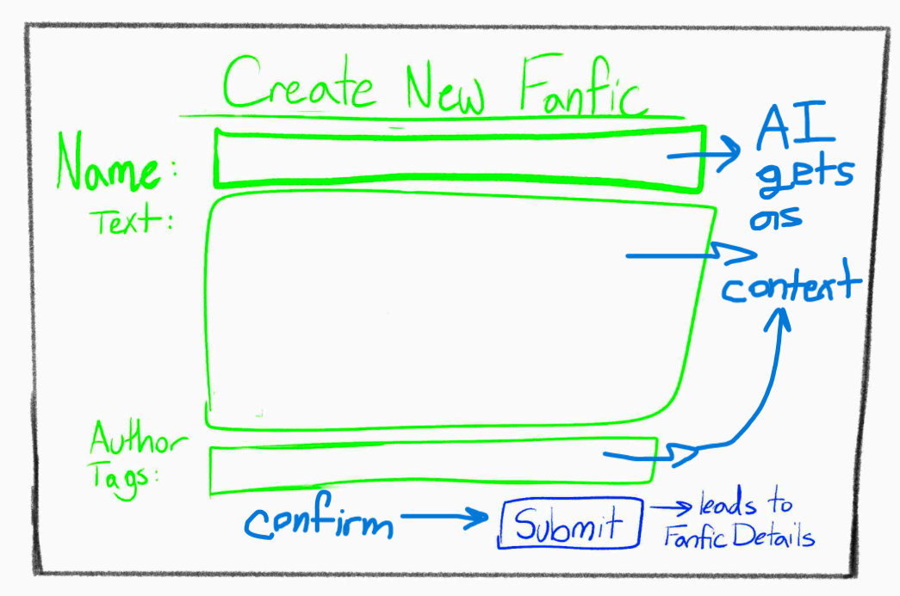
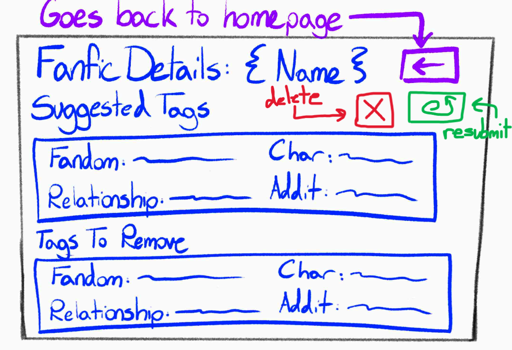

# Categorization

## Concept: DayPlanner

[Link to Concept Spec](CategorizationSpec.md)

## User interaction





## User Journey

A new author is confused at the tagging system of AO3, and goes to Create a New Fanfic, which sends them to a form where they fill out the name, copy and paste the fic text into a box, and fill out another box of tags they've thought of. Then, they click "submit", and are shown their results: suggested tags to add, tags to remove from the author's list of tags, and reasons explaining each choice. They feel more confident in posting their fic because they now know how to tag and understand tagging etiquette.


## Test Cases

Note: The actual titles, body text of fanfiction, and authorTags can be found within [The Categorization Tests](dayplanner-tests.ts). The samples below do not include the stories as to make everything more concise.

Credit for the fics created:

Ariana H.

Isa J.

Hannah T.

The application includes four comprehensive test cases:

### 1. Tag Suggestion
Demonstrates being able to add tags that are crucial to a story:

```typescript
const fic: Fic = {title: "title", text: "textwithCharacter1", authorTags: ["NotCharacter1", "MissingCrucialTagCharacter1"]};
const category = new Categorization();
await category.keywordGeneratorTagCleaner(llm, fic);
const suggestions = category.tagsToString(fic);
```

#### Sample Output

```
Suggested tags:
=======================

Character:
-----------------------
Character1: Character1 is a crucial part of the story and thus needs to be tagged

Tags to leave out:
=======================

```


### 2. Tag Removal
Shows how tags can be removed if they do not pertain to the story

```typescript
const fic: Fic = {title: "title", text: "textWithoutCharacter2", authorTags: ["Character1", "Character2"]};
const category = new Categorization();
await category.keywordGeneratorTagCleaner(llm, fic);
const suggestions = category.tagsToString(fic);
```

#### Sample Output

```
Suggested tags:
=======================


Tags to leave out:
=======================

Character:
-----------------------
Character2: Character2 is not a part of this story and thus should be removed.
```

### 3. Tag Categories Deletion
Demonstrates deleting multiple ficCategories from Categorization

```typescript
const fic: Fic = {title: "title", text: "text", authorTags: ["tag1"]};
const fic2: Fic = {title: "title2", text: "text2", authorTags: ["tag2"]};
const category = new Categorization();
await category.keywordGeneratorTagCleaner(llm, fic);
await category.keywordGeneratorTagCleaner(llm, fic2);
category.deleteFicCategories([fic, fic2]);
```

### 4. Tag Category Deletion
Demonstrates deleting one ficCategory from Categorization

```typescript
const fic: Fic = {title: "title", text: "text", authorTags: ["tag1"]};
const category = new Categorization();
await category.keywordGeneratorTagCleaner(llm, fic);
category.deleteFicCategories(fic);
```

## Prompt Variations

### Attempt 1:

Approach: The AI suggests tags that don't appear in the text, such as "You should add Marvel Cinematic Universe because the author's proposed tags contain 'Iron Man'", despite the fact that Iron Man does not show up in the text. Thus, I shall edit my prompt to state "You should NOT consider the author's proposed tags when suggesting tags to add."

What worked: The AI no longer tried to add things that were mentioned in the proposed tags but not the story itself (i.e. no more Iron Man in a Batman fic).

What went wrong: Nothing regarding the AI suggesting tags that are in the author's tags but not the story itself.

Issues that still remain: Removing tags is too strict and it doesn't like tags that it doesn't recognize.


### Attempt 2:

Approach: I used the test cases to see what the AI outputted. I went through the code and found that because the CSV of tags I got was from 2021, there are tags from newer fandoms that the AI does not recognize, and suggests to remove. Furthermore, because I thought giving the AI 1 million tags to analyze would be far too much, I shortened it down to 50,000 tags. Because of this, there are some fandom-specific tags under 100 uses that are not recognized. It shouldn't be so strict about suggesting to remove things it doesn't recognize. I added to the prompt "Do NOT suggest to remove a tag just because it is not standard, recognized, or within the list of recognized tags." and changed a previous rule from "Use only tags within the official list" to "Only suggest to add tags that are present in the official list."

What worked: It now just wants to remove those tags because they are unsupported by the story.

What went wrong: It still wants to remove tags that aren't supported by the story, but still lists the reason as because it's unsupported by the official tag list, but there isn't much I can do about it other than get a newer set of tags, but AO3 only ever released one.

Issues that still remain: It tried to suggest to remove tags that are "too specific", like relationships of Iron Man & Sans, and reccommends broader tags instead, but this is not desired. Also tried to suggest M/M because Batman and Robin are friends. No, M/M is for romance.

### Attempt 3:

Approach: Added context that explained that slashes are for romance and & and Gen are for platonic relationships or where the story doesn't center around romance. Also, forbade the AI from removing tags because they are too specific.

What worked: No longer removes tags because they are too specific, now wants to remove them for being unsupported by the story.

What went wrong: Whenever it wants to correctly remove something and the tag isn't recognized, it states it is because it is too specific and doesn't belong in the official tag list. Functionally, it works, because it won't remove something BECAUSE it is too specific or not within the official tag list, but it'll just say that's the reason why if it is correctly removing something unmentioned in the story.

Issues that still remain: Just by a glance at the tags, the AI can't guess the context behind them and goes simply off of the denotation. For instance, "(Character)'s A+ Parenting" is used in a sarcastic lens, and doesn't refer to actually good parenting, which the AI couldn't know without being provided with fics associated with that tag. Not much I can do without giving it the context of all of AO3's fics, but that is infeasible.

## Validators

Most of these are subjective and are hard to find things that are explicitly disallowed simply based on hard coding, like if it adds a character that isn't within the story. However, the AI should NOT suggest to add tags that are already within the author's proposed tags. Similarly, it shouldn't remove tags that the author didn't suggest. I'm changing the rule that "You should NOT consider the author's proposed tags when suggesting tags to add" to "Do not rely on the author's proposed tags as evidence." I'm adding checks at the very end that ensure tags are not duplicated nor removed even though they weren't suggested.

If the tag's name, type, or reason is empty, an issue should be raised, as it doesn't make any sense! All of those parts are critical to the experience.
